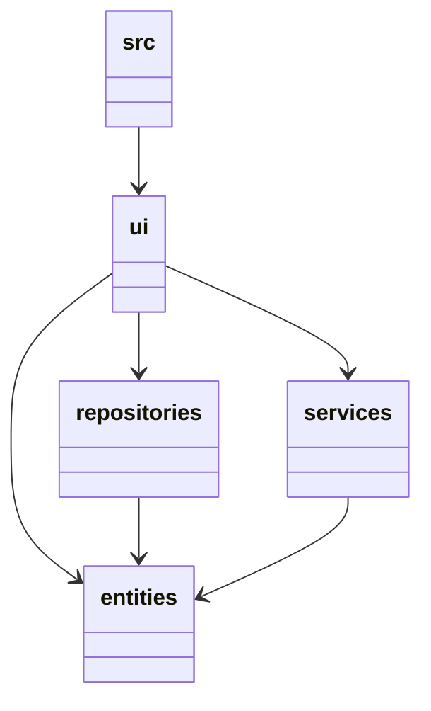
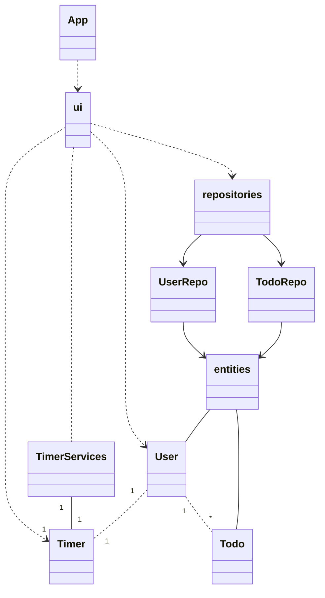
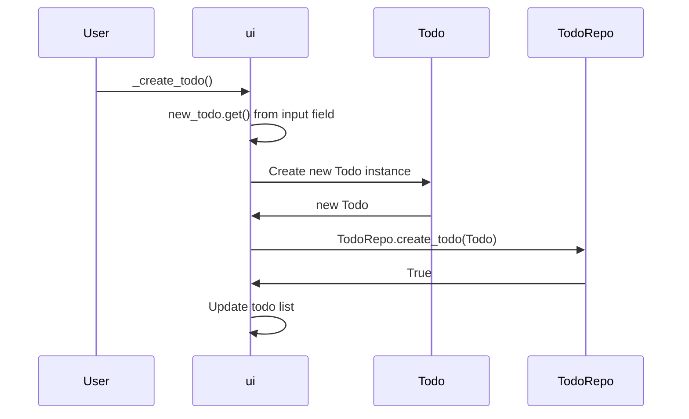

# Arkkitehtuurikuvaus  
### Koodin pakkausrakenne  

- ui sisältää käyttöliittymän koodin.
- repositories mahdollistaa entities luokkien tietokantatoiminnot.
- services sisältää luokan jonka avulla ui voi manipuloida entities kansion ajastin luokkaa.
- entities sisältää muut sovelluksen käyttämät luokat.  
### Luokkakaavio  

### Sovelluslogiikka  
Sovelluksen käyttöliittymän toiminnallisuudesta vastaa:  
[TimerService](https://github.com/lllIIlIIlll/ot-harjoitustyo/blob/master/src/services/timer_service.py), joka hallinnoi ajastimen toimintoja.  
[TodoRepo](https://github.com/lllIIlIIlll/ot-harjoitustyo/blob/master/src/reporitories/todo_repo.py), joka mahdollistaa todojen lisäyksen, muokkaamisen ja poistamisen.  
[UserRepo](https://github.com/lllIIlIIlll/ot-harjoitustyo/blob/master/src/reporitories/user_repo.py), joka mahdollistaa kirjautumisen ja rekisteröitymisen.  
### Sekvenssikaavio  
