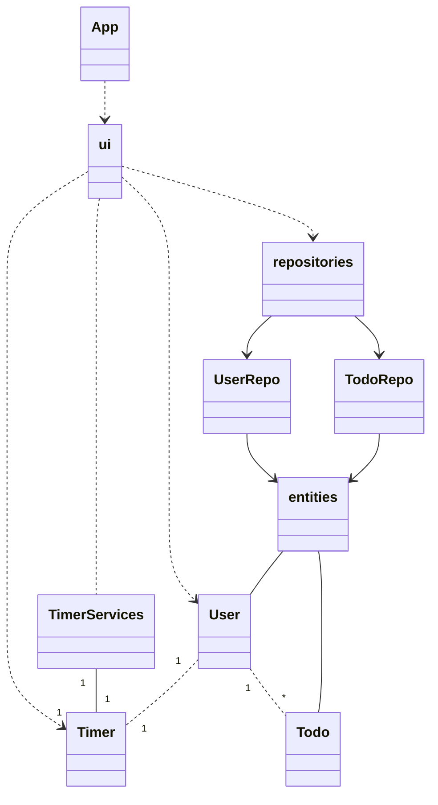
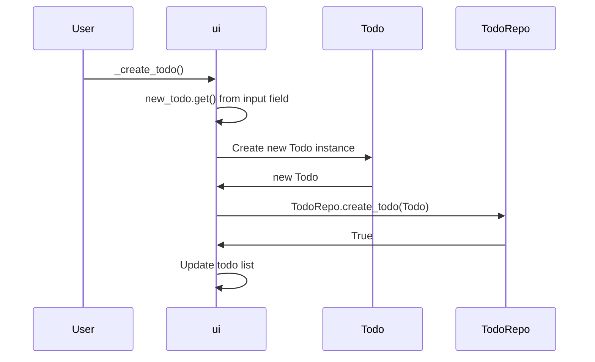

### Luokkakaavio  

```mermaid
classDiagram
   App ..> ui
   ui ..> "1" Timer
   ui ..> repositories
   ui ..> User
   repositories --> UserRepo
   repositories --> TodoRepo
   UserRepo --> entities
   TodoRepo --> entities
   ui .. TimerServices
   TimerServices "1" -- "1" Timer
   User "1" .. "1" Timer
   User "1" .. "*" Todo
   entities -- User
   entities -- Todo
```  
### Sekvenssikaavio  

```mermaid
sequenceDiagram
  participant User
  participant ui
  participant Todo
  participant TodoRepo
  User ->> ui: _create_todo()
  ui ->> ui:  new_todo.get() from input field
  ui ->> Todo: Create new Todo instance
  Todo ->> ui: new Todo
  ui ->> TodoRepo: TodoRepo.create_todo(Todo)
  TodoRepo ->> ui: True
  ui ->> ui: Update todo list
```