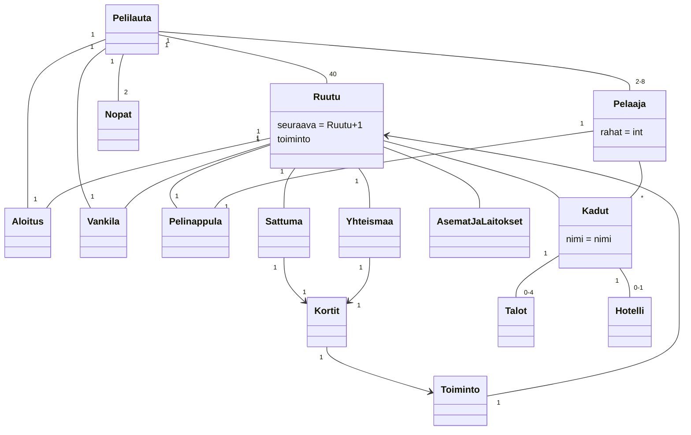

```mermaid
classDiagram
Pelilauta "1" -- "40" Ruutu
Pelilauta "1" -- "1" Aloitus
Pelilauta "1" -- "1" Vankila
Pelilauta "1" -- "2-8" Pelaaja
Pelilauta "1" -- "2" Nopat
Ruutu "1" -- "1" Pelinappula
Ruutu "1" -- Aloitus
Ruutu "1" -- Vankila
Ruutu "1" -- Sattuma
Ruutu "1" -- Yhteismaa
Ruutu -- AsematJaLaitokset
Ruutu -- Kadut
Pelaaja "1" -- "1" Pelinappula
Sattuma "1" --> "1" Kortit
Yhteismaa "1" --> "1" Kortit
Kortit "1" --> Toiminto
Toiminto "1" --> Ruutu
Pelaaja -- "*" Kadut
Kadut "1" -- "0-4" Talot
Kadut "1" -- "0-1" Hotelli

class Ruutu {
    seuraava = Ruutu+1
    toiminto
}

class Kadut {
    nimi = nimi
}

class Pelaaja {
    rahat = int
}
```