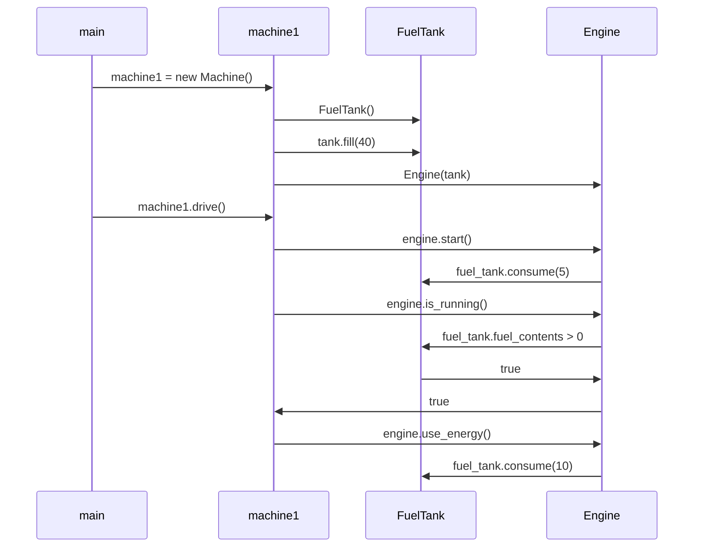

```mermaid
sequenceDiagram
  participant main
  participant machine1
  participant FuelTank
  participant Engine
  main ->> machine1: machine1 = new Machine()
  machine1 ->> FuelTank: FuelTank()
  machine1 ->> FuelTank: tank.fill(40)
  machine1 ->> Engine: Engine(tank)
  main ->> machine1: machine1.drive()
  machine1 ->> Engine: engine.start()
  Engine ->> FuelTank: fuel_tank.consume(5)
  machine1 ->> Engine: engine.is_running()
  Engine ->> FuelTank: fuel_tank.fuel_contents > 0
  FuelTank ->> Engine: true
  Engine ->> machine1: true
  machine1 ->> Engine: engine.use_energy()
  Engine ->> FuelTank: fuel_tank.consume(10)
```