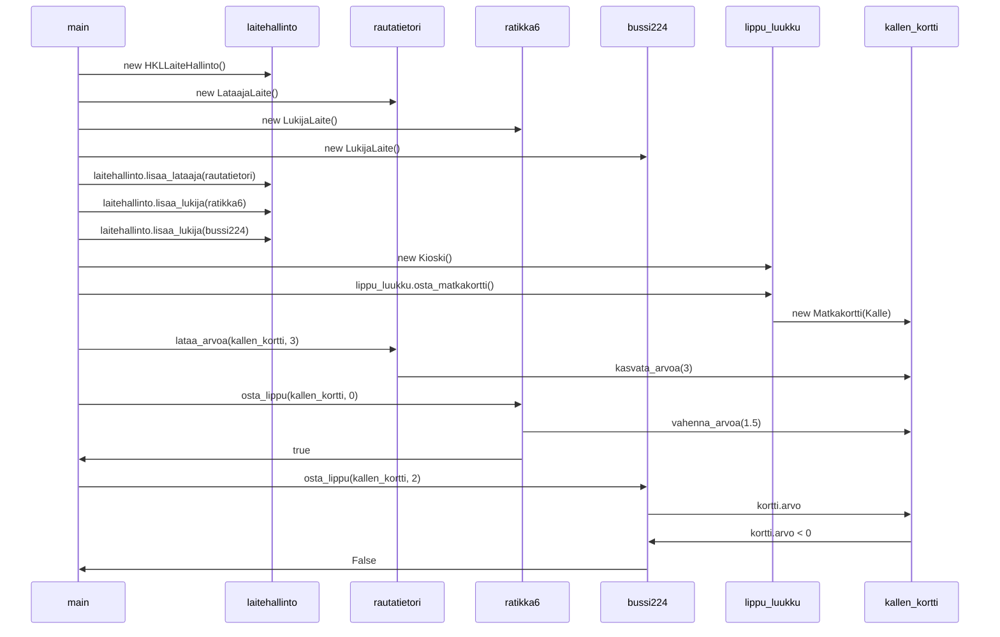

```mermaid
sequenceDiagram
  participant main
  participant laitehallinto
  participant rautatietori
  participant ratikka6
  participant bussi224
  participant lippu_luukku
  participant kallen_kortti
  main ->> laitehallinto: new HKLLaiteHallinto()
  main ->> rautatietori: new LataajaLaite()
  main ->> ratikka6: new LukijaLaite() 
  main ->> bussi224: new LukijaLaite()
  main ->> laitehallinto: laitehallinto.lisaa_lataaja(rautatietori)
  main ->> laitehallinto: laitehallinto.lisaa_lukija(ratikka6)
  main ->> laitehallinto: laitehallinto.lisaa_lukija(bussi224)
  main ->> lippu_luukku: new Kioski()
  main ->> lippu_luukku: lippu_luukku.osta_matkakortti()
  lippu_luukku ->> kallen_kortti: new Matkakortti(Kalle)
  main ->> rautatietori: lataa_arvoa(kallen_kortti, 3)
  rautatietori ->> kallen_kortti: kasvata_arvoa(3)
  main ->> ratikka6: osta_lippu(kallen_kortti, 0)
  ratikka6 ->> kallen_kortti: vahenna_arvoa(1.5)
  ratikka6 ->> main: true
  main ->> bussi224: osta_lippu(kallen_kortti, 2)
  bussi224 ->> kallen_kortti: kortti.arvo
  kallen_kortti ->> bussi224: kortti.arvo < 0
  bussi224 ->> main: False
```